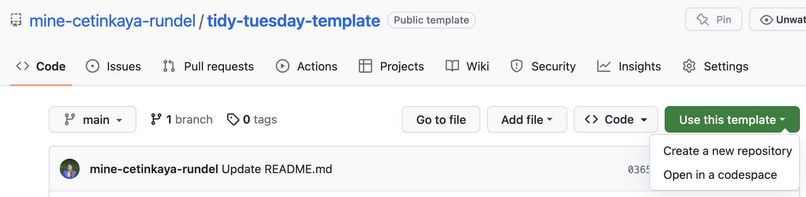
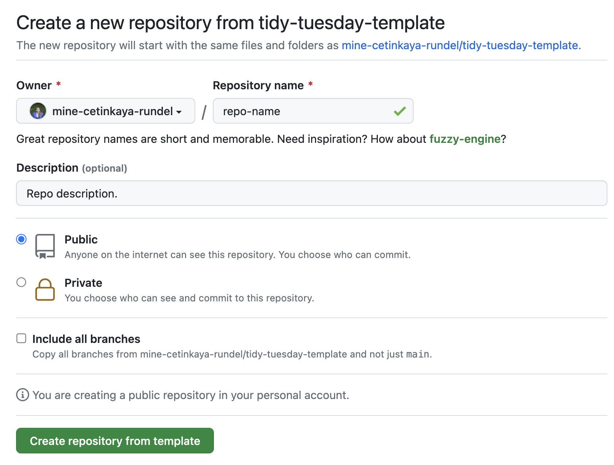
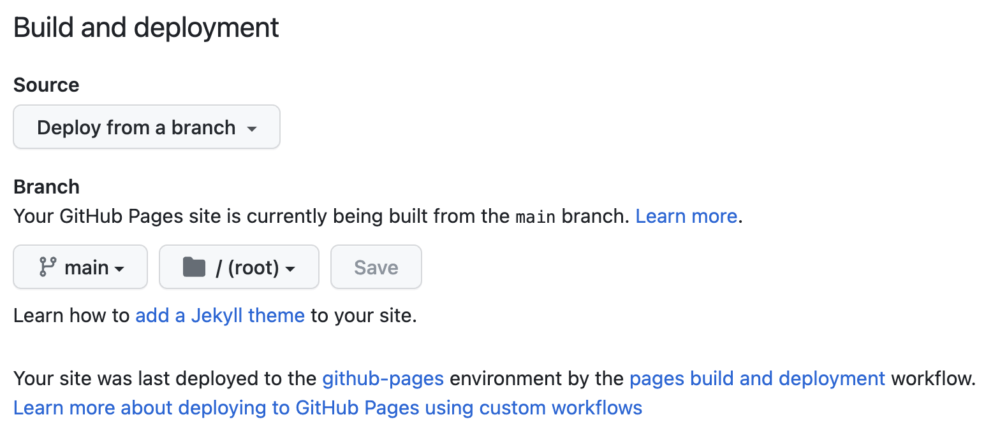

# tidy-tuesday-template

Getting started with this template for your own TidyTuesday projects:

1. Click on Use this template (green button) and then Create a new repository.

 

 

2. In the next screen,

  - select your GitHub account as the *Owner*,
  - give your repository a name that is relevant to TidyTuesday as well as the dataset you're going to be working with, e.g. if you'll be working with a dataset on cats, you might choose `tidy-tuesday-cats` (note no spaces!),
  - select *Public* for your project setting, and
  - click on *Create repository from template*.

 

 

3. Once your repo is created, clone the repo with RStudio > File > New Project.

4. Add your TidyTuesday exploration to `index.qmd`, render and push all your files. (Note: Do not rename this file.)

5. On GitHub, go to *Settings*, select *Pages* from the sidebar, and

  - for Source, select Deploy from branch, and
  - for Branch, select main and leave the rest as is.

6. Go back to the root of your repo, click the Gear icon next to About, and in the pop-up window check the box for *Use your GitHub Pages website* and add tags as suggested below.
